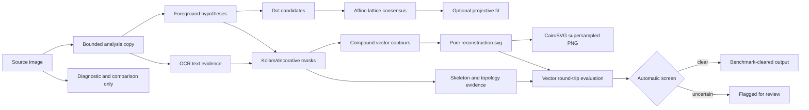

# Kolam Reconstruction: Methodology and Results

## Executive summary

This project reconstructs a source photograph as a clean, source-independent SVG composition and renders the corresponding PNG from that SVG. Source pixels appear only in the labeled diagnostic and side-by-side comparison artifacts. They are never embedded in `reconstruction.svg` or pasted into `reconstruction.png`.

The evaluation is deliberately staged:

| Gate | Scope | Clear requirement | Result |
|---|---:|---:|---:|
| Fixed difficult benchmark | 30 real images | At least 28 clear; zero silent invariant failures | **30/30 clear (100%)** |
| Deterministic expansion | 200 real images, excluding the 30 benchmark images | At least 187 clear; zero errors; zero silent invariant failures | **193/200 clear (96.5%)** |
| Full corpus | 4,429 real images | Report screened/flagged results and retain per-image provenance | **Paused by request after 3,800 checkpointed cases** |

The 200-image expansion passed its gate. Seven difficult cases were rejected automatically rather than being allowed to pass silently: three topology round-trip mismatches, two cases below 95% stroke agreement, one case with no confidently recoverable stroke layer, and one implausibly dense foreground.

The correct headline is therefore: **the pipeline cleared the automatic real-image vector/topology screen on 193 of 200 unseen sampled images, with all seven observed failures contained by explicit flags.** This is not the same as human-annotated exact graph accuracy. Canonical tile/port connectivity annotations are not available for the corpus, so that stronger claim is intentionally not made.

## What should be analyzed

The analysis should be presented in five layers. This keeps the visual demo compelling while making the evidence auditable.

1. **Dataset and sampling provenance**
   - State the six corpus roots and the number of images from each.
   - Show that the 200-image expansion was deterministic, proportionally stratified, SHA-256 frozen, and excluded the original 30 benchmark cases.
   - Report the exact pipeline version and analysis resolution.

2. **Reconstruction integrity**
   - Verify that every image has `diagnostic.png`, `reconstruction.svg`, `reconstruction.png`, `comparison.png`, and `result.json`.
   - Scan every SVG for `<image>` and `data:image`; both counts must be zero.
   - Verify that the clean PNG renderer is CairoSVG with bounded supersampling and Lanczos downsampling.

3. **Shape and topology fidelity**
   - Rasterize the authoritative SVG back at analysis resolution.
   - Compare it with the extracted foreground mask using exact IoU, source coverage, prediction precision, and stroke-width-tolerant F1 agreement.
   - Compare connected-component count and Euler characteristic after removing noise smaller than the local stroke scale.
   - Treat disagreement as a flag rather than silently accepting a plausible silhouette.

4. **Detection and inference diagnostics**
   - Report foreground occupancy and luminance contrast.
   - Report detected dot count, affine-lattice status, occupancy, residual, and perspective-fit status where applicable.
   - Report skeleton component, endpoint, and junction statistics.
   - Summarize flag and notice distributions so systematic failure modes are visible.

5. **Qualitative review**
   - Present labeled source/reconstruction comparisons from every data type: clean dot-based, noisy/textured, perspective, text/watermark, multi-design, and dotless.
   - Show at least one automatically flagged example beside a passing example.
   - Keep diagnostics separate from clean reconstruction images.

## How to present the analysis

For a faculty review, paper appendix, or live demo, use the following order:

1. Open with a three-number result panel: benchmark clear rate, 200-image clear rate, and silent-failure count.
2. Show the pipeline diagram below and explicitly point out the source-pixel boundary.
3. Show six side-by-side comparisons, one per difficult-image category.
4. Show the flag-reason distribution. Explain that flags are successful containment, not hidden failures.
5. Show metric distributions rather than only averages: median, 5th percentile, and minimum for stroke agreement, coverage, precision, and IoU.
6. Close with the full-corpus screened/flagged breakdown and the limitations statement.

Do not present the tolerant foreground score as “exact tile accuracy.” The strongest evidence available here is automatic vector round-trip fidelity plus explicit failure containment. Exact graph claims require completed human annotations or known generator truth.

## Pipeline methodology

### 1. Content-addressed input and resumption

Every source file is hashed with SHA-256. Its output directory combines a safe filename stem with the first twelve hash characters, which prevents collisions between equal stems in different corpus folders. Cached results are reused only when all required artifacts exist, the input hash matches, and the pipeline version is unchanged.

The 200-image evaluation uses seed `20260823`. It samples proportionally from the known corpus roots after excluding the fixed benchmark paths, then writes an immutable manifest containing absolute path, source stratum, and SHA-256 for every selected image.

### 2. Bounded-resolution analysis

The original image dimensions are retained for the SVG viewBox. Detection and graph evidence are computed on an aspect-preserving copy whose largest dimension is 1,200 pixels. Coordinates are mapped back to source space for the authoritative SVG. Diagnostic and comparison previews are separately bounded so very large photographs cannot cause uncontrolled memory use.

### 3. Foreground segmentation

The pipeline evaluates bright and dark foreground hypotheses using both local contrast and global intensity quantiles. Near-binary images additionally use Otsu threshold hypotheses. Candidate masks are scored by:

- foreground occupancy;
- connected-component fragmentation;
- size of the largest coherent component; and
- luminance contrast against the inferred background.

The selected mask is morphologically closed at a scale tied to image dimensions. Tiny components are removed for photographic inputs but retained for genuinely binary line art, where a one-pixel component can be meaningful.

### 4. Text and watermark evidence

OCR runs in sparse-text mode. Only plausible words with at least three alphabetic characters and adequate confidence are admitted as text evidence. Their padded regions are excluded from the kolam inference mask and recorded in diagnostics. This prevents recognizable watermark words from being treated as dot or stroke evidence.

OCR is intentionally conservative: it may miss stylized text, but a weak OCR token is never allowed to prove kolam connectivity.

### 5. Multi-scale dot candidates

Two candidate families are used:

- compact connected components with roundness, fill, area, and aspect checks; and
- Laplacian-of-Gaussian blobs for dots that touch a stroke and are therefore not isolated components.

Candidates are spatially deduplicated. Blob evidence is admitted only when a dense global lattice supports it, because loop ends, flower centers, crossings, and text punctuation can otherwise look dot-like. On highly textured images, candidate counts are capped and the expensive blob stage is suppressed; the uncertainty is retained as a notice.

### 6. Affine lattice and perspective evidence

The lattice estimator searches for two repeated translation families using global pair-vector consensus. It supports rotated diamonds and unequal basis lengths instead of assuming a rectangular, axis-aligned grid. Candidate origins are tested by mapping points into lattice coordinates and selecting one point per rounded cell under a spacing-relative residual threshold.

Dense lattice completion is allowed only when observed occupancy is at least 90%, the grid is small enough to be credible, and the fitted lattice is stable. Any added center is labeled `lattice_imputed`; it is not disguised as a directly detected dot.

When sufficient correspondences exist, projective RANSAC estimates an image-to-lattice transform. An unstable homography is not applied; the unrectified branch is retained and uncertainty is flagged.

### 7. Region separation and topology evidence

The dot-supported region, or the largest coherent foreground component for dotless designs, defines the kolam region. Foreground outside it is retained as decorative evidence rather than discarded. OCR-supported text is excluded from the kolam stroke mask.

Detected dots are removed from the stroke mask before skeletonization. Short skeleton branches are pruned only for tractable cases. For complex images the pipeline records fast vectorized endpoint, junction, pixel, and connected-component statistics without performing expensive fragment tracing.

Eight directional ports are sampled around affine-lattice centers. Local pairings are recorded only when connected-component evidence inside the affine cell is unambiguous. Ambiguous crossings remain explicitly unresolved instead of being guessed.

### 8. Authoritative SVG reconstruction

The final visible reconstruction is generated from connected foreground contours, not from a copy of the source photograph and not from disconnected diagnostic skeleton fragments. Each connected region is padded before contour extraction so an image-edge component cannot be accidentally closed into a large triangle. Diagonal connectivity is preserved during contour finding.

The SVG contains named vector groups for decorative content, kolam content, and dots. The dot group is empty when dots already exist in the foreground silhouette, avoiding invented duplicate circles. The SVG includes a vector background rectangle and compound `<path>` contours with an even-odd fill rule. It contains no embedded raster image.

### 9. Clean PNG rendering

`reconstruction.png` is derived only from `reconstruction.svg` through CairoSVG. Images up to 1,600 pixels are rendered at 4× resolution; images up to 2,600 pixels use 2×; larger outputs use Cairo’s direct antialiasing. Supersampled images are downsampled with Lanczos. This removes the jagged PIL-polyline output used by the earlier prototype while bounding memory on very large sources.

### 10. Round-trip fidelity metrics

The authoritative SVG is rasterized at the analysis resolution and classified into predicted foreground/background. Four primary shape measurements are retained:

- **Exact IoU:** exact foreground intersection divided by union. This is sensitive to antialiasing and contour boundary placement.
- **Source coverage:** fraction of source-foreground pixels lying within one locally estimated stroke-width of the reconstruction.
- **Prediction precision:** fraction of reconstructed pixels lying within the same tolerance of source foreground.
- **Stroke agreement:** harmonic mean of source coverage and prediction precision.

The tolerance is estimated from the median skeleton distance-transform width, not a fixed pixel number.

Topology is checked after removing components and holes below the local stroke-scale noise area. The evaluator compares connected-component count and Euler characteristic with one-percent relative slack. Extremely strong bidirectional shape agreement can resolve threshold-only raster discrepancies, but lower-agreement cases remain flagged.

### 11. Automatic release screen

An image clears only if all of the following are true:

- all five output artifacts exist;
- SVG contains no `<image>` element or raster data URI;
- PNG renderer is the approved CairoSVG path;
- stroke agreement is at least 95%;
- vector topology matches the observed source topology;
- graph status records validated observed-source topology; and
- the pipeline itself issued no hard flag.

An image whose status says `auto_pass` but fails any independent invariant is counted as a **silent bad auto-pass**. The allowed count is zero.

The expansion gate applies the original benchmark ratio to 200 cases: `ceil(200 × 28 / 30) = 187` required clears. Processing exceptions are a hard gate failure, even if the percentage threshold would otherwise be met.

## Dataset and evaluation protocol

### Full corpus composition

| Source | Images |
|---|---:|
| Archive 6 — color | 2,085 |
| Archive 6 — grayscale | 1,732 |
| Archive 6 — generated/LoRA output | 12 |
| Archive 7 — Kolam109 | 100 |
| Archive 7 — Kolam19 | 400 |
| Archive 7 — Kolam29 | 100 |
| **Total** | **4,429** |

### Deterministic 200-image expansion

| Source | Sampled images |
|---|---:|
| Color | 94 |
| Grayscale | 78 |
| Generated | 1 |
| Archive 7 — Kolam109 | 4 |
| Archive 7 — Kolam19 | 18 |
| Archive 7 — Kolam29 | 5 |
| **Total** | **200** |

The expansion contains no image from the fixed 30-image benchmark.

## Results

### Fixed 30-image benchmark

- Cleared: **30/30 (100%)**
- Missing artifact sets: **0**
- SVGs containing embedded source/raster data: **0**
- Silent bad auto-passes: **0**
- Scope: automatic real-image shape/topology screen; canonical human topology annotations remain pending.

### Deterministic 200-image expansion

- Cleared: **193/200 (96.5%)**
- Required: **187/200 (93.5%)**
- Automatically flagged: **7**
- Processing errors: **0**
- Pure SVGs: **200/200**
- Silent bad auto-passes: **0**
- Runtime: **781.79 seconds** with two workers, or approximately **0.26 images/second** including difficult-image tail latency.

Flag distribution:

| Flag reason | Images |
|---|---:|
| Vector topology round-trip mismatch | 3 |
| Vector stroke agreement below 95% | 2 |
| No confidently recoverable kolam stroke layer | 1 |
| Foreground occupancy implausibly dense | 1 |

Manual inspection of the seven flagged comparisons confirmed that the flags point in the correct direction. The two low-agreement images omit substantial thin linework. The three topology flags retain a visually similar silhouette but alter thresholded component/hole structure. The dense case contains an unusually dominant foreground, and the no-stroke case is visually reproduced as foreground decoration but cannot be confidently assigned to the kolam graph.

### Full corpus

The full 4,429-image reconstruction was paused by request after the 3,800-case checkpoint. At that checkpoint, 3,578 cases cleared the automatic screen, 222 were explicitly flagged, no processing error was recorded, and no automatic invariant failure was silently passed. The 94.16% checkpoint clear rate remains provisional because the final 629 images have not been evaluated. There are 3,841 content-addressed directories because several workers had begun the next cases before shutdown; resumption validates all five required artifacts and safely regenerates any interrupted partial directory.

### Butterfly composition stress test

An additional 974 × 710 butterfly composition was evaluated after pausing the corpus run. It combines a dense decorative dot field, four internal kolam regions, ornamental borders, text-like loops, and multiple foreground colors.

- Pipeline status: `auto_pass`
- Embedded raster data in SVG: **none**
- Stroke agreement: **99.739%**
- Source coverage: **99.480%**
- Prediction precision: **100%**
- Exact IoU: **67.211%**
- Strict raster topology match: **false**
- Reference/reconstruction components: **92 / 224**
- Reference/reconstruction Euler characteristic: **−355 / −36**

The side-by-side result is visually strong, but this case is not accepted as a trustworthy structural clear. The permissive high-agreement fallback overrode a large strict-topology discrepancy. It therefore demonstrates why visual closeness and tolerant pixel agreement must be shown alongside, not instead of, strict topology measurements. The image also produced a low-occupancy affine lattice (8.72%) and many false OCR boxes on loop motifs. Both should become conservative uncertainty signals in the next pipeline version before the full corpus is resumed.

## Artifact layout

Each content-addressed image directory contains:

- `diagnostic.png` — source preview with region box, OCR evidence, detected dots, and skeleton evidence;
- `reconstruction.svg` — authoritative pure-vector reconstruction;
- `reconstruction.png` — antialiased CairoSVG render;
- `comparison.png` — explicitly labeled source and clean reconstruction side by side; and
- `result.json` — input hash, pipeline version, graph evidence, metrics, notices, flags, status, and artifact paths.

Batch-level files contain the frozen manifest, checkpoint report, and final screening report.

## Limitations and correct interpretation

1. The automatic score measures agreement with the automatically selected source foreground. A bad segmentation hypothesis can therefore affect both reconstruction and reference. Contrast, occupancy, topology, and visual review reduce this risk but do not eliminate it.
2. `validated_source_topology` means that the SVG round-trip preserves the observed binary foreground topology at the defined scale. It does not mean that a canonical tile graph has been proven against human ground truth.
3. Exact IoU is deliberately retained as a diagnostic but is not the primary score, because subpixel antialiasing and contour placement can lower IoU even when the visible stroke lies within its local width.
4. OCR is conservative and may miss stylized logos or handwritten text. Ambiguous content should be reviewed from `diagnostic.png`.
5. Decorative content is vectorized as foreground shape, but median foreground coloring can simplify multicolor artwork.
6. The corpus result should be labeled **benchmark-cleared by the automatic screen**, not universally verified or graph-perfect.

## Reproducibility

- Pipeline version: `2026.08.benchmark-v29`
- Benchmark report: `outputs/benchmark_v29/benchmark_all_report.json`
- 200-image manifest: `outputs/corpus_sample_200_v29/manifest.json`
- 200-image report: `outputs/corpus_sample_200_v29/screening_report.json`
- Full-corpus manifest: `outputs/corpus_full_v29/manifest.json`
- Full-corpus report: `outputs/corpus_full_v29/screening_report.json` after completion
- Runner: `src/run_corpus_reconstruction.py`
